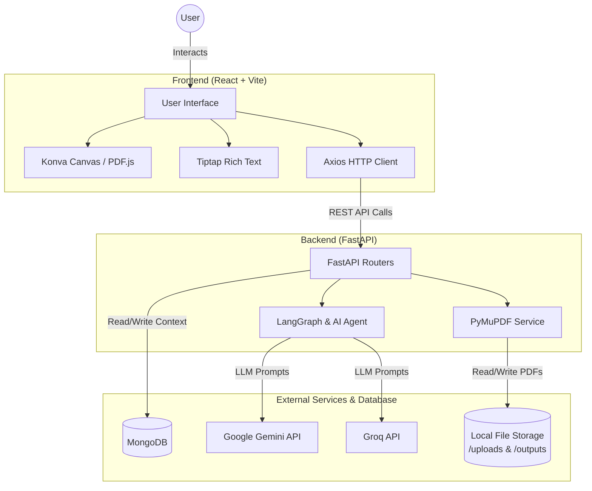
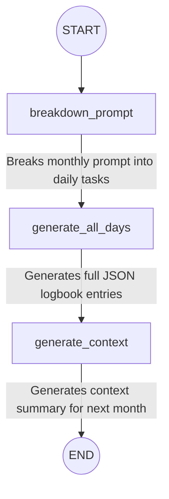

# LogiFlow AI: Smart PDF Logbook Editor

An AI-powered web application for viewing, editing, and generating PDF logbooks. The platform allows users to manually interact with PDF logbooks using a rich canvas interface or automatically generate detailed logbook entries over a date range using Google's Gemini AI.

## Tools & Technologies Used

### Frontend 💻
*   **Framework:** [React 19](https://react.dev/) with [Vite](https://vitejs.dev/) as the bundler.
*   **Canvas & PDF Rendering:** 
    *   `react-konva` & `konva` for an interactive canvas interface to manipulate PDF elements.
    *   `pdfjs-dist` for rendering PDF pages as images on the canvas.
*   **Rich Text Editing:** [Tiptap](https://tiptap.dev/) (headless rich text editor framework) using extensions like `@tiptap/starter-kit`, `@tiptap/extension-color`, etc.
*   **Routing:** `react-router-dom` for handling frontend page navigation.
*   **HTTP Client:** `axios` for making API requests to the backend.

### Backend ⚙️
*   **Framework:** [FastAPI](https://fastapi.tiangolo.com/) (Python) running on an `uvicorn` ASGI server.
*   **PDF Manipulation:** [PyMuPDF](https://pymupdf.readthedocs.io/) (`pymupdf`) for server-side PDF reading, editing, text extraction, and generation.
*   **AI & Orchestration:** 
    *   `google-genai` and `langchain-google-genai` to interface with Google's Gemini LLM.
    *   `langchain-groq` to interface with Groq models.
    *   `langgraph` and `langchain-core` for building stateful, multi-actor AI agent workflows to formulate logbook entries.
*   **Data Validation:** `pydantic` for strict typing and schema definitions of API requests/responses.
*   **Database Integration:** `motor` (asynchronous Python driver for MongoDB) to persist states or application contexts.


## Architecture Diagram

Here is a mermaid diagram illustrating the overall architecture of the application:



### LangGraph AI Agents Workflow

The logbook generation feature relies on a multi-agent LangGraph workflow (`month_logbook_app`) to formulate the entries month by month. Here is the node progression:




## 🛠️ Project Setup

### Prerequisites
- Node.js (v18+)
- Python (v3.9+)
- Google Gemini API Key (stored in `.env` in the backend directory)
- GROQ API Key (stored in `.env` in the backend directory)
- MongoDB Atlas connection URI (required for context persistence between months)

### Backend Setup

1. Navigate to the `backend` directory:
   ```bash
   cd backend
   ```
2. Create and activate a Python virtual environment:
   ```bash
   python -m venv venv
   
   # On Windows:
   venv\Scripts\activate
   # On macOS/Linux:
   source venv/bin/activate
   ```
3. Install the required dependencies: 
   ```bash
   pip install -r requirements.txt
   ```
4. Start the server:
   ```bash
   uvicorn main:app --reload
   ```
   *The FastAPI backend will run on `http://localhost:8000`.*

### Frontend Setup

1. Navigate to the `frontend` directory:
   ```bash
   cd frontend
   ```
2. Install the Node dependencies:
   ```bash
   npm install
   ```
3. Start the Vite development server:
   ```bash
   npm run dev
   ```
   *The frontend application will be served at `http://localhost:5173`.*

## 📁 Project Structure

- `/backend`: Houses the FastAPI application. Key components include Pydantic schemas, PDF routing/upload logic, PyMuPDF business logic (`services/pdf_service.py`), and LangGraph/Gemini AI agents (`services/ai_service.py`).
- `/frontend`: Contains the React UI. It features a canvas interface constructed with Konva for annotating PDFs, as well as forms for specifying date ranges to generate logbooks.

## ✨ Core Features
- **Interactive PDF Viewer:** Renders PDF pages as interactive images on a canvas using `pdfjs-dist` and Konva.
- **AI-Powered Generation:** Formulate intelligent, automated logbook entries utilizing LangGraph workflows and Google's Gemini LLM, GROQ .
- **Rich Text Annotations:** Add, position, and format text directly onto PDF representations using Tiptap integration.
